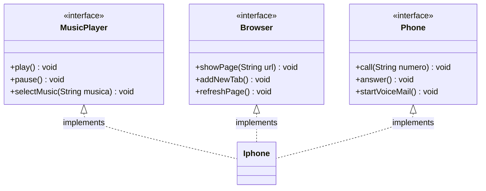

# Desafio DIO POO - Modelagem UML do iPhone

## Sobre o Projeto
Este projeto consiste na modelagem orientada a objetos e diagramação UML das funcionalidades principais de um componente iPhone, inspirado no vídeo de lançamento do iPhone 2007. A ideia é representar, por meio de interfaces e classes, três funcionalidades principais do aparelho: Reprodutor Musical, Aparelho Telefônico e Navegador de Internet.

O projeto exemplifica a aplicação dos conceitos de Programação Orientada a Objetos (POO), por meio da modelagem UML e da implementação concreta de interfaces e classes na linguagem Java.

### Diagrama UML
